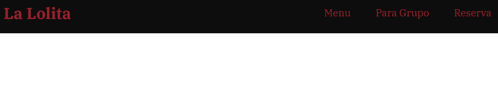
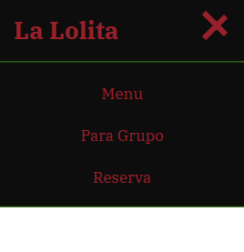

# Header Project

Responsive header development for all screen sizes.

## 💻 Live Demo

[👉 View the demo](https://jonathanpons.github.io/header/)

## 📸 Preview

  

## 📁 Project Structure

- `index.html` – project structure
- `style.css` – styling
- `script.js` – interactivity

## ✨ Features

- Responsive navigation menu
- Smooth navigation
- Mobile-first design
- Menu animation on click

## ⚙️ Technologies Used

- HTML
- CSS
- JavaScript
